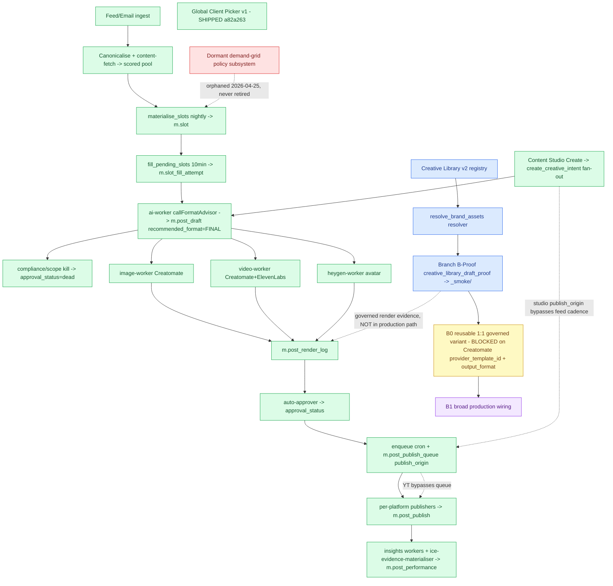

# Current ICE Architecture / Operator Flow — v1 snapshot

> **⚠️ SUPERSEDED 2026-06-26 by [`current-ice-flow-v2.md`](./current-ice-flow-v2.md).** v2
> corrects the B0 status (now **PROVEN proof-only / `_smoke/` only / zero production leakage**,
> not "planned / Creatomate-blocked"), records **B1-v1** as a committed-off-tree `carry_deferred`
> (`branch-b-lane-b1-v1` `00b48b1`, not merged/deployed/proved), removes the stale B0→B1
> Creatomate edge, refreshes anchors to **CE `b855ced` / dashboard `53cb569`**, fixes the L3
> legacy demand-grid labelling (`platform_format_mix_default` is a **table**, not a function),
> and adds the layered **L0–L8** map with an embedded legend — backed by the `db-rls-auditor`
> **PASS 8/8 (2026-06-26)**. This v1 file is retained as the historical first snapshot; the
> B0/B1 labels below are **stale** — read v2.

> **What this is:** a point-in-time, evidence-grounded snapshot of the ICE content-production
> spine, produced by the read-only `ice-architecture-cartographer` subagent (Proving Run #1)
> and reconciled by the orchestrator against git. **Generated, not hand-drawn.**
> **Mode:** read-only / docs-only. No app/function/DB/deploy change is made by this document.
> **Date:** 2026-06-25
> **Anchors (git-verified by orchestrator):**
> - CE `main == origin/main == 93e2b8b`
> - Dashboard `main == origin/main == a82a263`
>
> **Live-truth caveat:** every `live_production` classification here is a **documented-claim +
> code-evidence inference**. This snapshot does **not** verify deployed EF versions, cron
> firing, or row existence. Live/runtime confirmation is a **`db-rls-auditor`** handoff
> (see §8). Doc/register drift is a **`register-reconciler`** handoff.

## Status legend

| Status | Meaning |
|---|---|
| `live_production` | Documented in production + corroborating worker/code evidence (live runtime not verified) |
| `proven_proof_only` | Proven via a named proof lane / proof render, NOT a productionised path |
| `planned_not_implemented` | Defined in a brief/architecture doc, no shipping code yet |
| `carry_deferred` | Explicitly recorded carry / deferred item |
| `stale_uncertain` | Evidence conflicting, outdated, or too weak to classify confidently |

---

## 1. Live production spine

`Feed/Email ingest → canonicalise + content-fetch → materialise_slots (nightly) →
fill_pending_slots (10-min cron) → ai-worker (callFormatAdvisor → m.post_draft,
recommended_format = FINAL) → {image-worker | video-worker | heygen-worker} →
m.post_render_log → auto-approver → enqueue cron + m.post_publish_queue (publish_origin) →
per-platform publishers (FB / IG / LI / YT / WordPress) → m.post_publish → insights workers +
ice-evidence-materialiser`

All nodes `live_production`. Cited to `docs/architecture/current-ice-decision-tree.md:26-58`
plus worker source (`supabase/functions/ai-worker/index.ts`, `image-worker/index.ts`,
`publisher/index.ts`).

**Live carries flagged on the spine:**
- **YouTube bypasses the publish queue** — `youtube-publisher` selects approved drafts
  directly (`current-ice-decision-tree.md:57`).
- **Production logo source = `c.client_brand_profile.brand_logo_url`, NOT the governed
  resolver** (`resolve_brand_assets` is only on the proof/manual path) — `00_sync_state.md`,
  image-worker source.
- **`ai-worker` is the live format decision-maker** (`callFormatAdvisor` →
  `recommended_format` = final format) and also kills out-of-scope drafts
  (`approval_status = dead`).

---

## 2. Content Studio operator flow (7-beat)

| Beat | Served by | Status |
|---|---|---|
| Create | Content Studio › Create Content (Single post / Series) → `create_creative_intent` fan-out; ai-worker | `live_production` |
| Track | Content Studio › Ideas (idea container); Series detail; `childStatusLine()` | `live_production` |
| Approve | auto-approver (agent) + Inbox → Drafts (operator) | `live_production` |
| Render | image-worker / video-worker / heygen-worker; `/visuals` | `live_production` |
| Queue/Schedule | enqueue cron + `m.post_publish_queue` (`publish_origin`); `/queue`; per-child ETA | `live_production` |
| Publish | per-platform publishers → `m.post_publish`; Overview 24h schedule | `live_production` |
| Learn | Performance (REPORTS); Analyse (HIDDEN, relocation pending); insights workers | `live_production` |

Cited to dashboard `docs/dashboard/operator-journey-ia-v1.md` (Lane 1 subset SHIPPED at
dashboard `b736d06`) + `current-ice-decision-tree.md`.

---

## 3. Creative Library / Branch B status

| Element | Status | Note |
|---|---|---|
| Creative Library v2 declarative registry | `proven_proof_only` | Governed + visible, **not consumed by any production worker**; declarative JSON only; A1.0–A1.5 closed |
| `resolve_brand_assets()` resolver | `proven_proof_only` | Live in prod but only on the **non-publishing** Branch B-Proof / manual-render path |
| Branch B-Proof (`creative_library_draft_proof`) | `proven_proof_only` | image-worker v73; proven render to `_smoke/`, zero side-effects; hardcoded `pp_news_static_16x9_v1`, property-pulse only |
| **Branch B0 reusable 1:1 governed variant** | `planned_not_implemented` | **BLOCKED on Creatomate `provider_template_id` + `output_format`** (PK must author the generic 1:1 template) — corroborated against both B0 briefs |
| Branch B1 broad production wiring | `carry_deferred` | Blocked after B0; registry cannot yet express a shared/brand-agnostic family |

Cited to `docs/00_sync_state.md` (v3.95), `docs/briefs/branch-b-lane-b0-governed-variant-proof.md`,
`docs/briefs/branch-b-lane-b0-template-contract-readiness-packet.md`,
`docs/creative-library/creative-library-next-mountain.md`, image-worker source.

---

## 4. Dashboard / operator surfaces

Confirmed live: Create / Ideas / Series / Inbox / Drafts / Queue / Overview / Performance.
Analyse is **hidden** (relocation to REPORTS pending). Cited to
`docs/dashboard/operator-journey-ia-v1.md`.

**Global Client Picker v1 — `live_production` (SHIPPED at dashboard `a82a263`).**
Dashboard HEAD `a82a263` = `feat(content-studio): global client picker v1 (shared shell
context)`. **Note the drift this snapshot corrects:** the brief
`docs/dashboard/global-client-picker-v1-brief.md` (at `f5bf6b5`) still read "PROPOSAL / IA
carry — NOT implemented" — stale relative to the shipped code. The brief is being updated to
SHIPPED in the same docs lane as this snapshot. **Deferred remainder (still NOT shipped):**
Slice 3 `?client=` URL sync and aggregate-page opt-in filters.

---

## 5. Data object ownership

| Object | Owning store (cited) | Owner / producer | Status |
|---|---|---|---|
| **Content request** | operator submission → `create_creative_intent` | Content Studio Create | `live_production` |
| **Creative intent / idea container** | `m.creative_intent` (fan-out → per-platform children) | Content Studio + ai-worker | `live_production` |
| **Series / Episode** | `content_series` (bucket) / episode = idea container | series-writer / outline | `live_production` |
| **Draft** | `m.post_draft` (`recommended_format` = final) | ai-worker | `live_production` |
| **Render log** | `m.post_render_log` | image / video / heygen workers | `live_production` |
| **Queue** | `m.post_publish_queue` (`publish_origin` = feed \| studio \| series) | enqueue cron / publisher | `live_production` |
| **Publish evidence** | `m.post_publish` + `ice_publication_evidence` (publish-state only — no classifier/fitness) | publishers + ice-evidence-materialiser | `live_production` |

Store/table names are documented + code inferences (T1 / registers / worker source). **Live
row existence is a `db-rls-auditor` handoff.**

---

## 6. Mermaid diagram

---

## 7. Stale / deferred / unknown

- **T1 decision tree >30d stale** — `docs/architecture/current-ice-decision-tree.md`
  `last_verified 2026-06-11`; its own §13 rule makes it non-authoritative until re-verified.
  → `register-reconciler` + `db-rls-auditor`.
- **Global Client Picker brief was stale** (said proposal; shipped `a82a263`) — corrected in
  this docs lane. → resolved here; reconcile any other references via `register-reconciler`.
- **Live/runtime/deploy truth unverified** — every `live_production` is an inference; EF
  versions live in `m.vw_ef_drift_current` (not readable statically). → `db-rls-auditor`.
- **Dormant demand-grid policy subsystem** (`build_weekly_demand_grid`,
  `match_demand_to_canonicals`, `platform_format_mix_default`) — valid functions, zero current
  callers, ran live 2026-04-25, orphaned by the slot rebuild, **never formally retired**.
  Decision fork (revive / retire / keep) open → PK + `register-reconciler`.
- **`resolve_brand_assets` migration-ledger parity** — resolver live in prod but not
  backfilled into `supabase/migrations` (recurring carry). → `db-rls-auditor`.

---

## 8. Recommendation — what the dashboard visual map should eventually render

Render the spine in §1/§6 **as the live default view**, with **status-coloured nodes** (the
five classes) so operators see live vs proof-only vs planned vs carry vs stale at a glance.
It should explicitly surface:
- the **two live carries** (YouTube-bypasses-queue; logo-from-brand-profile-not-resolver);
- the **Creative Library / Branch B lane as a clearly-separated `proof_only` track** feeding
  nothing in production;
- **B0 as a blocked node** (Creatomate dependency).

It must be **generated from a source-of-truth artifact like this snapshot, not hand-drawn**,
and **refreshed when T1 is re-verified** — replacing the outdated dashboard visual flow.
Live-truth panels (deploy/version/row counts) should pull from a `db-rls-auditor` pass, not be
inferred by the cartographer.

---

## Provenance

- **Generator:** `ice-architecture-cartographer` (read-only; `Read`/`Grep`/`Glob`),
  Proving Run #1, 2026-06-25 — verdict `WARN` (provisional pending live/git truth).
- **Orchestrator reconciliation:** git-verified both anchors (CE `93e2b8b`, dashboard
  `a82a263`); reclassified Global Client Picker v1 `carry_deferred` → `live_production` on the
  `a82a263` evidence; surfaced the stale brief.
- **Not verified here:** live deploy/runtime/DB truth (`db-rls-auditor`); register HEAD
  reconciliation for the post-v3.95 `.claude/` + B0 commits (`register-reconciler`).
