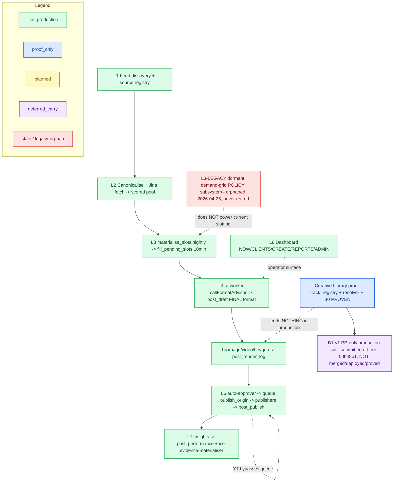
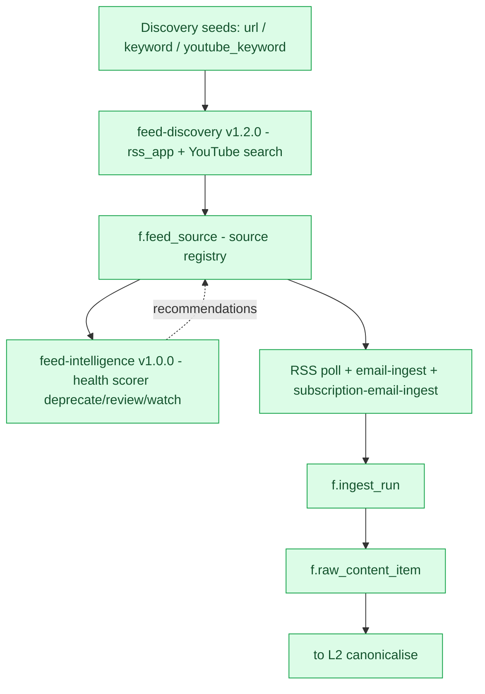
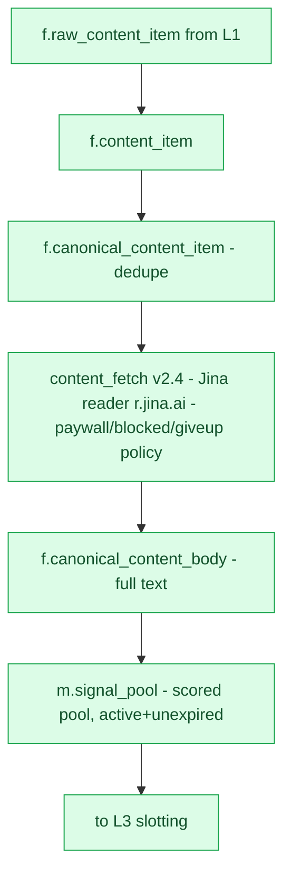
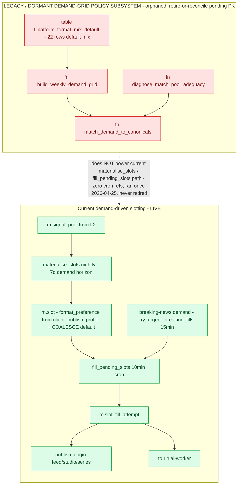

# Current ICE Architecture / Operator Flow — v2 snapshot

> **⚠️ SUPERSEDED 2026-06-26 by [`current-ice-flow-v3.md`](./current-ice-flow-v3.md).** v3
> reconciles the **Branch B B1-v1 production release**: B1-v1 `carry_deferred` → **`live_production`
> (PP-only `image_quote`, RELEASED, image-worker v3.14.1)**, adds the **one governed production
> edge into L5**, scopes the logo-source carry (PP `image_quote` → governed resolver; all else
> legacy brand_profile), flips `governed_nonsmoke_renders` 0 → **≥1 by design**, refreshes
> anchors to **CE `6fcbda0` / dashboard `11775ef`**, and records **Creative Library Dashboard
> Slice 1** shipped. **B0 remains `proven_proof_only`; broad Creative Library wiring remains
> `planned`.** v2's B1 labels are stale — read v3.

> **What this is:** a point-in-time, evidence-grounded snapshot of the ICE content-production
> spine, refreshed to a layered (L0–L8) map by the read-only `ice-architecture-cartographer`
> and reconciled by the orchestrator. **Generated, not hand-drawn.** Supersedes
> [`current-ice-flow-v1.md`](./current-ice-flow-v1.md).
> **Mode:** read-only / docs-only. No app/function/DB/deploy change is made by this document.
> **Date:** 2026-06-26
> **Anchors (git-verified by orchestrator):**
> - CE `main == origin/main == b855ced`
> - Dashboard `main == origin/main == 53cb569`
> **Runtime evidence baseline:** `db-rls-auditor` read-only **PASS 8/8 (2026-06-26)** against
> live project `mbkmaxqhsohbtwsqolns` — every live-spine layer confirmed writing within a
> 7-day window; the legacy demand-grid confirmed orphaned from cron; B0 governed renders
> `_smoke/`-only (0 production leakage). See §7.
> **Live-truth caveat:** a `live_production` classification = documented-claim + code evidence
> + the 2026-06-26 runtime corroboration. EF `verify_jwt` and the Supabase deploy serial are
> **not DB-readable** (source from deploy/config evidence). Git anchors asserted by the
> orchestrator.

## Status legend (embedded in every Mermaid below)

| Class | Colour | Meaning |
|---|---|---|
| `live_production` | **Green** | In production + code + 2026-06-26 runtime evidence |
| `proven_proof_only` | **Blue** | Proven via a named proof lane, NOT a productionised path |
| `planned_not_implemented` | **Yellow** | Defined in a brief/doc, no shipping code yet |
| `carry_deferred` | **Purple** | Explicitly deferred / committed-off-tree carry |
| `stale_uncertain` / legacy-orphan | **Red** | Conflicting/outdated, or a superseded-in-practice orphan |

---

## 1. What changed since v1

- **B0 — CORRECTED `planned_not_implemented` → `proven_proof_only` (PROVEN).** v1 labelled B0
  "planned / BLOCKED on Creatomate `provider_template_id`+`output_format`." That blocker is
  **resolved**: PK authored the generic 1:1 template; B0 is **PROVEN, proof-only, `_smoke/`
  only, zero production leakage**. Evidence: register **v3.98**; CE `4ebec3b`; image-worker
  **v3.13.0** (impl `news_static_centered_scrim_1x1_v1`, provider_template_id `fb9820f8…`,
  output `image/jpeg`); final proof `render_log 50f09ca2` (1080×1080 JPEG,
  `post-images/_smoke/branch_b_proof_edf01c52…_1x1.jpg`, `resolver_used=true`,
  `fallback_taken=false`); 18/18 deno tests; 16:9 + manual path byte-unchanged.
  *(2026-07-05 pointer: provider template `fb9820f8…` was DELETED provider-side in the
  2026-07-02/03 Creatomate cleanup — B0 proof evidence remains valid history, but the
  template no longer exists; PP image_quote production is now Option-D winner-driven
  (image-worker v3.22.0). See `docs/creative-library/property-pulse.json` v0.4 retirements +
  `docs/briefs/results/creatomate-provider-reconciliation-v0-result.md`.)*
- **B1-v1 — re-worded.** v1 said "B1 broad wiring blocked after B0." Reality: **B1-v1 is a
  Property-Pulse-only production cut, committed off-tree on branch `branch-b-lane-b1-v1`
  (`00b48b1`), NOT merged / NOT deployed / NOT proved** (git-confirmed unmerged into main).
  Broad B1 remains future. Classified `carry_deferred` from the on-main cut-plan brief only
  (Session 3 lane; its branch code is deliberately not read).
- **The v1 `B0 → B1 (BLOCKED on Creatomate)` edge is removed** — premise outdated. v2 draws
  B0 as a proven proof node feeding a `carry_deferred` B1-v1.
- **Runtime baseline upgraded:** v1 carried "runtime confirmation optional/future"; v2 is
  backed by `db-rls-auditor` **PASS 8/8 (2026-06-26)** (§7).
- **L3 legacy labelling corrected** (§4): `platform_format_mix_default` is the **table
  `t.platform_format_mix_default`** (22 rows), NOT a function; the genuine legacy functions
  are `build_weekly_demand_grid`, `match_demand_to_canonicals`, `diagnose_match_pool_adequacy`.

---

## 2. Layered map structure (L0–L8)

| Layer | Purpose (plain English) | Dominant status | Evidence |
|---|---|---|---|
| **L0** | Whole content-production spine on one screen, with the Creative Library proof track shown as a separate parallel lane that feeds nothing in production | live_production (spine) | decision-tree §2; §7 runtime PASS |
| **L1** | Auto-discover sources, keep a health-scored source registry, poll RSS/email into raw items | live_production | `feed-discovery` v1.2.0, `feed-intelligence` v1.0.0, `email-ingest`; §7 CHECK 1 |
| **L2** | Dedupe to canonical items, fetch full body via Jina reader, assemble the per-vertical scored pool | live_production | `content_fetch` v2.4 (`r.jina.ai`); `m.signal_pool`; §7 CHECK 2 |
| **L3** | Current demand-driven slotting: nightly demand → slots → 10-min fill (+ urgent/breaking parallel) | live_production | `materialise_slots`→`m.slot`; `fill_pending_slots`→`m.slot_fill_attempt`; §7 CHECK 3 |
| **L3-LEGACY** | Dormant demand-grid **policy** subsystem — SEPARATE, orphaned, never retired | stale_uncertain (legacy-orphan) | decision-tree §7; §7 CHECK 4 (zero cron refs) |
| **L4** | ai-worker = FINAL format decision (`callFormatAdvisor`) + compliance/scope kill | live_production | `ai-worker`→`m.post_draft.recommended_format`; §7 CHECK 8 |
| **L5** | Route by format → Creatomate (image/video, +ElevenLabs) / HeyGen; production logo from brand profile; Creative Library is the SEPARATE governed proof track | live_production (render) + proof track | `image/video/heygen-worker`→`m.post_render_log`; §5; §7 CHECK 5–6 |
| **L6** | Auto-approver → enqueue cron → `m.post_publish_queue` (cadence; studio bypass) → per-platform publishers; YouTube bypasses the queue | live_production | decision-tree §6; §7 CHECK 8 |
| **L7** | Daily insights → performance; evidence materialiser (publish-state only) | live_production | `insights-worker`→`m.post_performance`; `ice-evidence-materialiser`→`r.ice_publication_evidence`; §7 CHECK 7 |
| **L8** | Operator surfaces: NOW/CLIENTS/CREATE/REPORTS/ADMIN shell; Content Studio 7-beat; global client picker | live_production | dashboard `operator-journey-ia-v1.md`; GCP `a82a263` |

For each layer's node-level status, evidence, and the `db-rls-auditor` question used to confirm
it live, see §7 (runtime pass) — every live node was confirmed there.

---

## 3. Mermaid drafts (with embedded colour legend)

All graphs share this `classDef` block: Green=live · Blue=proof_only · Yellow=planned ·
Purple=deferred_carry · Red=stale_uncertain/legacy-orphan.

### L0 — whole spine

### L1 — feed discovery + intake

### L2 — canonicalise + content-fetch + scored pool

### L3 — demand / slotting (current LIVE path + SEPARATE legacy subsystem)

*(L4–L8 are represented as nodes in the L0 spine above; their per-node status + evidence are in
§2 and §7. Per-layer drill-down Mermaid for L4–L8 can be drafted in a follow-up — NOT
approximated here without re-vetting against source.)*

---

## 4. Demand-grid vs current slotting — labels (Q6–Q9, evidence-corrected)

- **Separate? YES.** The legacy functions appear in **zero** `supabase/functions/*/index.ts`
  and have **zero cron references** (`db-rls-auditor` CHECK 4); the current slot path
  (`materialise_slots`, `fill_pending_slots`) references neither (decision-tree §7).
- **Current LIVE slotting (L3):** `materialise_slots` (nightly DB fn, 7-day horizon, reads
  `preferred_format_*` from `c.client_publish_profile`) → `m.slot` → `fill_pending_slots`
  (10-min cron, `COALESCE(format_preference[1],'image_quote')`) → `m.slot_fill_attempt`;
  `try_urgent_breaking_fills` is the parallel breaking-news demand path. Cron jobs confirmed
  active (CHECK 3).
- **Legacy dormant subsystem (L3-LEGACY) — exact members:** **functions**
  `build_weekly_demand_grid`, `match_demand_to_canonicals`, `diagnose_match_pool_adequacy`
  (schema `m`); plus the **table `t.platform_format_mix_default`** (22 rows — the universal
  default mix) and `c.client_format_mix_override` (0 rows). Ran live one morning (2026-04-25),
  lost its consumer in the slot emergency rebuild, never formally retired.
- **Recommended label:** **"LEGACY / DORMANT DEMAND-GRID POLICY SUBSYSTEM — orphaned,
  retire-or-reconcile pending PK"**, status `stale_uncertain`, drawn as a **separate red box**
  with the caption **"does NOT power the current materialise_slots / fill_pending_slots
  path"** and only a dashed orphaned annotation — **never** an active edge into
  `materialise_slots`. This must not imply the live slot system is broken (it is healthy —
  CHECK 3).

---

## 5. Creative Library lane (visually separated proof track)

| Element | Status | Note / evidence |
|---|---|---|
| Creative Library v2 declarative registry | `proven_proof_only` | governed + visible (dashboard A1.5); NOT consumed by any production worker |
| `resolve_brand_assets()` resolver | `proven_proof_only` | live in prod but only on the non-publishing Lane-3B / Branch-B-Proof path; production render reads `c.client_brand_profile.brand_logo_url` |
| Branch B-Proof (`creative_library_draft_proof`) | `proven_proof_only` | proven render to `_smoke/`, zero side-effects (v3.95) |
| **B0 reusable 1:1 governed template** | **`proven_proof_only` (PROVEN)** | v3.98 / `4ebec3b` / image-worker v3.13.0; impl `news_static_centered_scrim_1x1_v1`; proof `render_log 50f09ca2`; `_smoke/` only; **0 production leakage** (CHECK 6: `governed_nonsmoke_renders=0`) |
| **B1-v1 (PP-only production cut)** | **`carry_deferred`** | committed off-tree `branch-b-lane-b1-v1` `00b48b1`; **NOT merged/deployed/proved** (git-confirmed); on-main evidence = the cut-plan brief only |
| Broad Creative Library production wiring | `planned_not_implemented` | future. Blockers: registry forces `client_slug` (no shared/brand-agnostic family); logo still brand-profile not resolver; no publisher/`image_url` wiring; no Advisor→variant selection; only 1:1 aspect proven |

The Creative Library lane **feeds nothing in production** — it is the parallel governed proof
track. Render it as a clearly-separated Blue lane (B0 = Blue PROVEN node; B1-v1 = Purple
off-tree carry; broad wiring = Yellow planned).

---

## 6. Data object ownership (carried from v1, unchanged)

| Object | Owning store | Producer | Status |
|---|---|---|---|
| Content request | operator submission → `create_creative_intent` | Content Studio Create | live_production |
| Creative intent / idea container | `m.creative_intent` (fan-out → per-platform children) | Content Studio + ai-worker | live_production |
| Series / Episode | `content_series` (bucket) / episode = idea container | series-writer / outline | live_production |
| Draft | `m.post_draft` (`recommended_format` = final) | ai-worker | live_production |
| Render log | `m.post_render_log` | image / video / heygen workers | live_production |
| Queue | `m.post_publish_queue` (`publish_origin` feed\|studio\|series) | enqueue cron / publisher | live_production |
| Publish evidence | `m.post_publish` + `r.ice_publication_evidence` (publish-state only) | publishers + ice-evidence-materialiser | live_production |

---

## 7. Runtime evidence — `db-rls-auditor` PASS 8/8 (2026-06-26, project `mbkmaxqhsohbtwsqolns`)

| # | Layer | Verdict | Evidence (7-day window) |
|---|---|---|---|
| 1 | L1 ingest + feed-intelligence cron | **PASS** | `f.ingest_run` 1,384 (46/48 active sources); `k.vw_feed_intelligence` live; crons `feed-intelligence-weekly` (j57) + `feed-discovery-daily` (j61) active |
| 2 | L2 Jina fetch + pool | **PASS** | `f.canonical_content_body` success 155 via jina; `m.signal_pool` active 1,528 (non-thin) |
| 3 | L3 slot crons | **PASS** | `m.slot` 121 / `m.slot_fill_attempt` 183; crons `materialise-slots-nightly` (j72) + `fill-pending-slots-every-10m` (j75) active |
| 4 | L3-LEGACY zero callers | **PASS** | 0 cron refs to the legacy fns; `c.client_format_mix_override` 0 rows. *(pg_stat `track_functions='none'` → dormancy inferred from zero-cron + superseding architecture)* |
| 5 | L5/B0 image-worker version | **PASS** | `m.vw_ef_drift_current`: image-worker **3.13.0** clean. `verify_jwt` + deploy serial = UNDETERMINED (not DB-readable) |
| 6 | L5/B1-v1 non-smoke = 0 | **PASS** | 6 governed renders **all `_smoke/`**, 0 non-smoke; B0 proof `50f09ca2` `_smoke/` only |
| 7 | L7 insights | **PASS** | `m.post_performance` 37 (NDIS16/PP14/Inv4/CFW3); `r.ice_publication_evidence` 71 |
| 8 | Cross-cut v3.97 regression | **PASS** | renders creatomate 614 / +voice 5 / heygen 10; publishes FB30/IG27/LI27/YT18/web4; drafts 121 (106 w/ recommended_format); queue feed31/studio9 — no regression |

**Non-findings (out of DB scope):** `verify_jwt` and deploy serial not DB-readable; legacy
"0 calls" inferred (no pg_stat); git not checked by the DB pass (anchors orchestrator-verified).

---

## 8. Live carries (on the spine — surface explicitly)

- **YouTube bypasses the publish queue** — `youtube-publisher` selects approved drafts
  directly; does not consume `m.post_publish_queue` (code-confirmed).
- **Production logo source = `c.client_brand_profile.brand_logo_url`, NOT the governed
  resolver** — image-worker `getBrandAndSlug` + video-worker `getBrand`; `resolve_brand_assets`
  only on the isolated Lane-3B / Branch-B-Proof paths.

---

## 9. Stale / deferred / unknown + handoffs

- **T1 decision tree** (`current-ice-decision-tree.md`) **>30d stale** (last_verified
  2026-06-11) — schedule re-verification → `register-reconciler` + `db-rls-auditor`.
- **Demand-grid retire/revive** decision fork open → PK (surface via `register-reconciler`).
- **Live `verify_jwt` / deploy serial** not DB-readable — source from deploy/config if surfaced.
- **B1-v1 merge/deploy/proof** is Session 3's lane — when it lands, gate its first governed
  production render via `db-rls-auditor` (`governed_nonsmoke_renders` must move off 0 under a
  proof, then production).

---

## 10. Dashboard design implications

- Use L0–L8 directly: L0 as the default one-screen spine; L1–L7 as drill-downs; L8 overlay.
- Persistent embedded 5-class colour legend (Green/Blue/Yellow/Purple/Red).
- Creative Library as a **clearly-separated Blue proof track** that feeds nothing in
  production — B0 Blue PROVEN, B1-v1 Purple off-tree carry, broad wiring Yellow planned.
- Dormant demand-grid as a **separate Red box** captioned "does NOT power current slotting" —
  never an active edge into `materialise_slots`.
- Surface the two live carries (YT-bypass, logo-source).
- Generate from this v2 artifact, not hand-drawn; refresh on T1 re-verification and on any
  B1-v1 merge; pull live deploy/version/row-count panels from a `db-rls-auditor` pass.
- The broad `operator-journey-ia-v1.md` spec is still a PROPOSAL (only Lane 1 shipped) — mark
  un-shipped IA items (Analyse→REPORTS, GCP Slice 3, Campaign/P-2, Ideas/Series naming) as
  carry/planned, not live.

---

## Provenance

- **Generator:** `ice-architecture-cartographer` (read-only; `Read`/`Grep`/`Glob`),
  Architecture Map v2 refresh, 2026-06-26 — verdict WARN (parts pending live verify), then
  upgraded by the runtime pass.
- **Runtime backing:** `db-rls-auditor` PASS 8/8 (2026-06-26), project `mbkmaxqhsohbtwsqolns`.
- **Orchestrator reconciliation:** git-verified anchors (CE `b855ced`, dashboard `53cb569`);
  confirmed B0 merged (`4ebec3b`) and B1-v1 unmerged (`00b48b1`); corrected the B0 status, the
  B1 wording, the removed B0→B1 Creatomate edge, and the L3 legacy table-vs-function labelling.
- **Not verified here:** live `verify_jwt`/deploy serial; T1 re-verification; B1-v1 branch code
  (Session 3 isolation).
