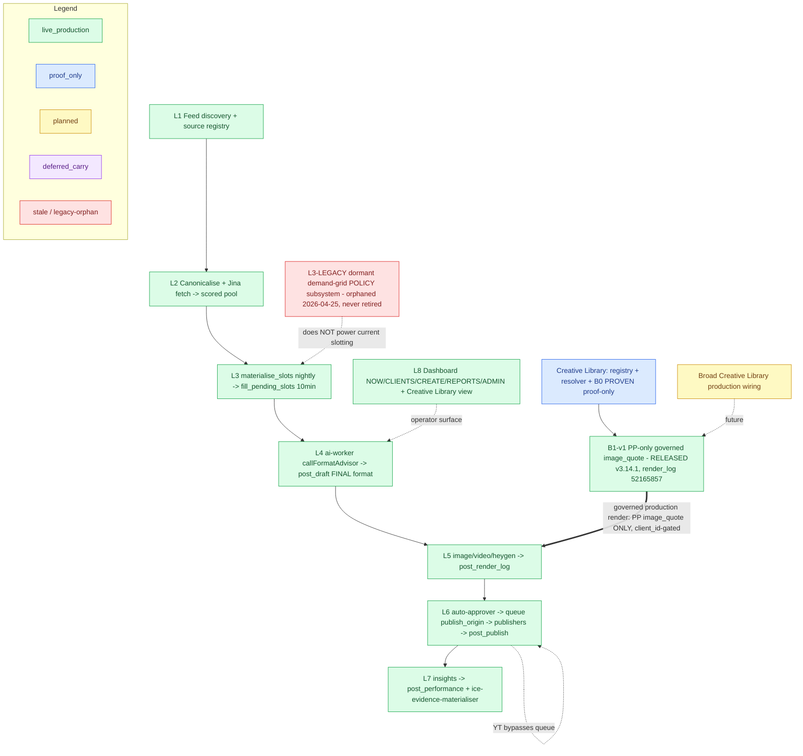
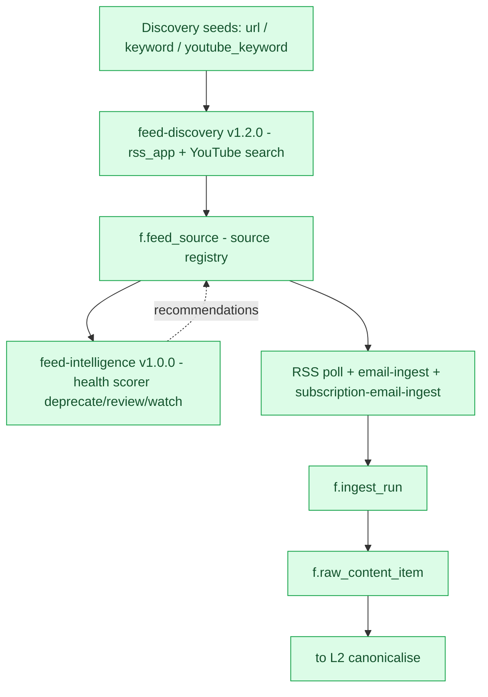
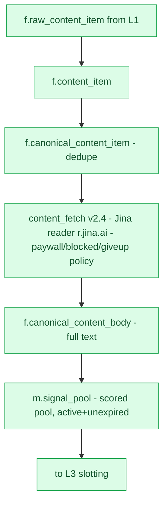
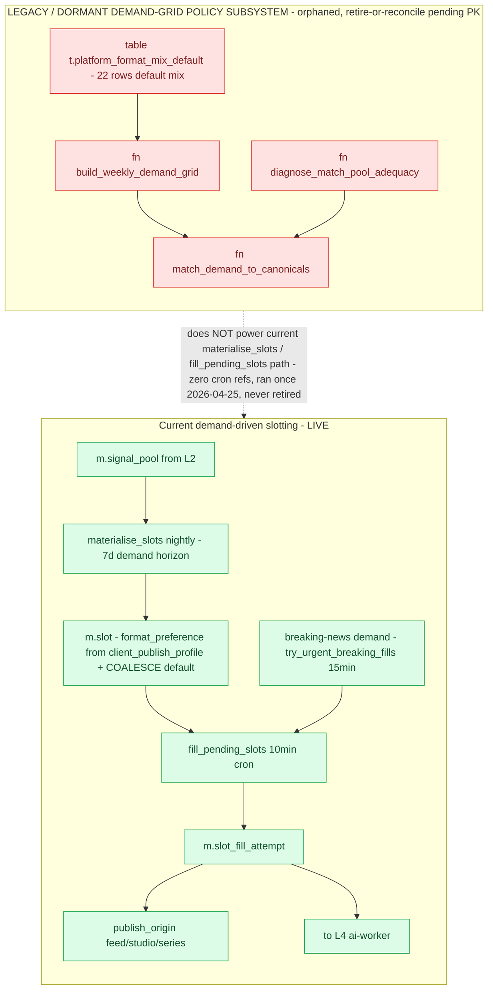

# Current ICE Architecture / Operator Flow — v3 snapshot

> **What this is:** a point-in-time, evidence-grounded snapshot of the ICE content-production
> spine (layered L0–L8), refreshed after the **Branch B B1-v1 production release**.
> **Generated, not hand-drawn.** Supersedes [`current-ice-flow-v2.md`](./current-ice-flow-v2.md).
> **Mode:** read-only / docs-only. No app/function/DB/deploy change is made by this document.
> **Date:** 2026-06-26 (v3 — B1-v1 release reconciliation)
> **Anchors (git-verified by orchestrator):**
> - CE `main == origin/main == 6fcbda0` (register **v4.00/v4.01**)
> - Dashboard `main == origin/main == 11775ef`
> **Image-worker:** **v3.14.1** live, `verify_jwt=false`; production crons jobid 27
> (image-worker-15min) + 58 (auto-approver-sweep) active.
> **Runtime evidence baseline:** `db-rls-auditor` PASS 8/8 (2026-06-26 AM). **B1-v1 released
> after that pass** → CHECK 6 (`governed_nonsmoke_renders`) now intentionally **≥1** (§7).
> **Live-truth caveat:** a `live_production` classification = documented-claim + code evidence
> + runtime corroboration. EF `verify_jwt` and the Supabase deploy serial are **not
> DB-readable**. Git anchors asserted by the orchestrator.

## Status legend (embedded in every Mermaid below)

| Class | Colour | Meaning |
|---|---|---|
| `live_production` | **Green** | In production + code + runtime evidence |
| `proven_proof_only` | **Blue** | Proven via a named proof lane, NOT a productionised path |
| `planned_not_implemented` | **Yellow** | Defined in a brief/doc, no shipping code yet |
| `carry_deferred` | **Purple** | Explicitly deferred / off-tree carry |
| `stale_uncertain` / legacy-orphan | **Red** | Conflicting/outdated, or a superseded-in-practice orphan |

---

## 1. What changed since v2 (Branch B B1-v1 release)

- **B1-v1 — `carry_deferred` → `live_production` (narrow, RELEASED).** v2 labelled B1-v1 a
  committed-off-tree carry (`00b48b1`, "not merged/deployed/proved"). Reality per register
  **v4.00**: B1-v1 is **PROVEN + RELEASED in production** for **Property Pulse only,
  `image_quote` only**. Released code = `1b33bcb` (v3.14.0 wire) → **`dc86710` (v3.14.1
  fix-forward)**; image-worker **v3.14.1** deployed. *(The v2 `00b48b1` ref was a never-merged
  WIP commit.)*
- **First governed Creative Library wiring into a live production render path.** Until now the
  Creative Library lane fed nothing in production; B1-v1 is the first **one** governed edge in.
- **v3.14.0 UUID-fallback near-miss (architecture lesson).** The first controlled proof failed
  *safely*: the governed gate keyed on `getBrandAndSlug().clientSlug`, which falls back to the
  client-id UUID when the PostgREST `c.client.client_slug` read returns null → the governed
  branch missed and **legacy rendered the proof draft** (0 publish, held). Fixed in **v3.14.1**
  by keying the gate on PP **`client_id`** + passing the canonical slug constant
  `'property-pulse'` to the resolver. (Same UUID-fallback class as the known voice-path bug.)
- **NDIS logo hotfix (mid-lane).** `ndis-yarns` `c.client_brand_profile.brand_logo_url` broke
  (HTTP 400) → NDIS `image_quote` drafts/queue stuck; fixed via a single guarded UPDATE.
  Reinforces the brand_profile logo-source fragility the governed resolver path avoids.
- **Creative Library Dashboard Slice 1 SHIPPED** (dashboard `11775ef`) — operator visibility
  for governed renders; the v2 "operator-visibility follow-up" is now **complete** (§10).

---

## 2. Layered map structure (L0–L8)

| Layer | Purpose | Dominant status | Evidence |
|---|---|---|---|
| **L0** | Whole spine on one screen; Creative Library shown as a parallel proof track with ONE governed production edge | live_production | decision-tree §2; v4.00; §7 |
| **L1** | Auto-discover sources, health-scored registry, poll RSS/email into raw items | live_production | `feed-discovery` v1.2.0, `feed-intelligence` v1.0.0; §7 CHECK 1 |
| **L2** | Dedupe → canonical, Jina body fetch, per-vertical scored pool | live_production | `content_fetch` v2.4; `m.signal_pool`; §7 CHECK 2 |
| **L3** | Current demand-driven slotting (nightly demand → slots → 10-min fill + urgent parallel) | live_production | `materialise_slots`→`m.slot`; `fill_pending_slots`→`m.slot_fill_attempt`; §7 CHECK 3 |
| **L3-LEGACY** | Dormant demand-grid **policy** subsystem — SEPARATE, orphaned, never retired | stale_uncertain (legacy-orphan) | decision-tree §7; §7 CHECK 4 |
| **L4** | ai-worker = FINAL format decision (`callFormatAdvisor`) + compliance/scope kill | live_production | `ai-worker`→`m.post_draft.recommended_format`; §7 CHECK 8 |
| **L5** | Route by format → Creatomate / HeyGen; **PP `image_quote` now renders via the governed resolver** (B1-v1); all else legacy logo from brand profile; Creative Library = proof track + one production edge | live_production (+ B1-v1 governed edge) | decision-tree §6; v4.00; §5; §7 CHECK 5–6 |
| **L6** | Auto-approver → enqueue cron → `m.post_publish_queue` → publishers; YT bypasses the queue | live_production | decision-tree §6; §7 CHECK 8 |
| **L7** | Daily insights → performance; evidence materialiser (publish-state only) | live_production | `insights-worker`→`m.post_performance`; `ice-evidence-materialiser`→`r.ice_publication_evidence`; §7 CHECK 7 |
| **L8** | Operator surfaces: NOW/CLIENTS/CREATE/REPORTS/ADMIN; Content Studio 7-beat; global client picker; **Creative Library dashboard governed-render view** | live_production | dashboard `operator-journey-ia-v1.md`; GCP `a82a263`; Creative Library Dashboard Slice 1 `11775ef` |

---

## 3. Mermaid drafts (with embedded colour legend)

All graphs share this `classDef` block: Green=live · Blue=proof_only · Yellow=planned ·
Purple=deferred_carry · Red=stale_uncertain/legacy-orphan.

### L0 — whole spine

### L1 — feed discovery + intake

### L2 — canonicalise + content-fetch + scored pool

### L3 — demand / slotting (current LIVE path + SEPARATE legacy subsystem)

*(L4–L8 are represented as nodes in the L0 spine; their per-node status + evidence are in §2
and §7. Per-layer drill-down Mermaid for L4–L8 can be drafted in a follow-up — not approximated
here without re-vetting.)*

---

## 4. Demand-grid vs current slotting (unchanged from v2)

- **Separate? YES** — legacy functions in zero EF source, zero cron refs (CHECK 4); current
  slot path references neither.
- **Current LIVE (L3):** `materialise_slots` → `m.slot` → `fill_pending_slots` →
  `m.slot_fill_attempt`; `try_urgent_breaking_fills` parallel. Crons active (CHECK 3).
- **Legacy dormant (L3-LEGACY):** functions `build_weekly_demand_grid`,
  `match_demand_to_canonicals`, `diagnose_match_pool_adequacy`; **table
  `t.platform_format_mix_default`** (22 rows, NOT a function); `c.client_format_mix_override`
  (0 rows). Label: **"LEGACY / DORMANT DEMAND-GRID POLICY SUBSYSTEM — orphaned,
  retire-or-reconcile pending PK"**, Red, caption **"does NOT power the current
  `materialise_slots` / `fill_pending_slots` path."** Current slotting is healthy (CHECK 3).

---

## 5. Creative Library lane (proof track + ONE governed production edge)

| Element | Status | Note / evidence |
|---|---|---|
| Creative Library v2 declarative registry | `proven_proof_only` | governed + visible; not consumed by production EXCEPT via the B1-v1 governed `image_quote` edge below |
| `resolve_brand_assets()` resolver | `live_production` (scoped) + `proven_proof_only` | **PP `image_quote` uses it in production** (B1-v1); also on the Lane-3B / Branch-B-Proof paths. **All other clients/formats still read `c.client_brand_profile.brand_logo_url`** |
| Branch B-Proof (`creative_library_draft_proof`) | `proven_proof_only` | proven render to `_smoke/`, zero side-effects |
| **B0 reusable 1:1 governed template** | **`proven_proof_only` (PROVEN)** | v3.98 / `4ebec3b` / image-worker v3.13.0; impl `news_static_centered_scrim_1x1_v1`; proof `render_log 50f09ca2`; **`_smoke/` only**. *(B0 proof renders are `_smoke/`; the production governed renders now in `m.post_render_log` are **B1-v1, not B0**.)* |
| **B1-v1 (PP-only governed `image_quote`)** | **`live_production` (narrow — RELEASED)** | v4.00; merged `1b33bcb`→`dc86710`; image-worker **v3.14.1**; PP-gated (`client_id 4036a6b5-b4a3-406e-998d-c2fe14a8bbdd`) governed branch INSIDE the production `image_quote` loop → `resolve_brand_assets` (logo `pp_logo_primary` + bg `bg_perth_cbd`) → governed `news_static_centered_scrim_1x1_v1` → `image_url=property-pulse/<id>.jpg`, `image_status='generated'`, `render_spec.label=creative_library_b1_production`; **governed-only fail-loud, NO legacy fallback for PP**. Controlled publish-held proof `render_log 52165857` (`resolver_used=true`, `fallback_taken=false`, `variant=centered-scrim-1x1`, queue 0 / publish 0; PK visual approval PASSED) |
| Broad Creative Library production wiring | `planned_not_implemented` | **future** — B1-v1 is narrow. Blockers: registry forces `client_slug` (no shared/brand-agnostic family); logo still brand-profile for non-PP/non-`image_quote`; no Advisor→variant selection; no contract validator; only 1:1 / single template / fixed `bg_perth_cbd` |

**Scope guard:** B1-v1 = **PP only · `image_quote` only · single 1:1 template · fixed
`bg_perth_cbd`.** Render it as a **single Green edge** into L5; broad wiring stays **Yellow**.
B0 stays **Blue** proof-only.

---

## 6. Data object ownership (carried from v2, unchanged)

| Object | Owning store | Producer | Status |
|---|---|---|---|
| Content request | operator submission → `create_creative_intent` | Content Studio Create | live_production |
| Creative intent / idea container | `m.creative_intent` (fan-out → per-platform children) | Content Studio + ai-worker | live_production |
| Series / Episode | `content_series` (bucket) / episode = idea container | series-writer / outline | live_production |
| Draft | `m.post_draft` (`recommended_format` = final) | ai-worker | live_production |
| Render log | `m.post_render_log` (now incl. B1-v1 governed PP `image_quote`) | image / video / heygen workers | live_production |
| Queue | `m.post_publish_queue` (`publish_origin` feed\|studio\|series) | enqueue cron / publisher | live_production |
| Publish evidence | `m.post_publish` + `r.ice_publication_evidence` (publish-state only) | publishers + ice-evidence-materialiser | live_production |

---

## 7. Runtime evidence — `db-rls-auditor` PASS 8/8 (2026-06-26 AM, project `mbkmaxqhsohbtwsqolns`)

| # | Layer | Verdict | Evidence (7-day window) |
|---|---|---|---|
| 1 | L1 ingest + feed-intelligence cron | **PASS** | `f.ingest_run` 1,384 (46/48 sources); crons j57 + j61 active |
| 2 | L2 Jina fetch + pool | **PASS** | `f.canonical_content_body` success 155 via jina; `m.signal_pool` active 1,528 |
| 3 | L3 slot crons | **PASS** | `m.slot` 121 / `m.slot_fill_attempt` 183; crons j72 + j75 active |
| 4 | L3-LEGACY zero callers | **PASS** | 0 cron refs to legacy fns; `c.client_format_mix_override` 0 rows |
| 5 | L5/B0 image-worker version | **PASS** (now v3.14.1) | AM read: 3.13.0 clean; **post-release image-worker is v3.14.1** (B1-v1). `verify_jwt`/serial UNDETERMINED |
| 6 | L5 governed non-smoke renders | **UPDATED — now ≥1 by design** | AM read `=0`; **B1-v1 released after** → the only non-`_smoke` governed renders are PP `image_quote` (`label=creative_library_b1_production`, e.g. `52165857`); held proof drafts `52165857`+`f7a94ee8` have **0 publish**. This supersedes the AM `=0` reading |
| 7 | L7 insights | **PASS** | `m.post_performance` 37; `r.ice_publication_evidence` 71 |
| 8 | Cross-cut v3.97 regression | **PASS** | renders creatomate 614 / +voice 5 / heygen 10; publishes FB30/IG27/LI27/YT18/web4; no regression |

**A fresh runtime pass at v3 time would confirm CHECK 6 ≥1** (PP `image_quote` governed only).
Non-findings unchanged: `verify_jwt`/serial not DB-readable; legacy "0 calls" inferred; git not
checked by the DB pass.

---

## 8. Live carries (on the spine — surface explicitly)

- **YouTube bypasses the publish queue** — `youtube-publisher` selects approved drafts
  directly.
- **Logo source — SCOPED (v3):** **PP `image_quote` → governed resolver
  (`resolve_brand_assets`)** (B1-v1); **all other clients/formats → `c.client_brand_profile.
  brand_logo_url` (legacy).**
- **`getBrandAndSlug` UUID-fallback fragility:** slug read can fall back to the client-id UUID
  (null `c.client.client_slug`) — fixed for the B1 gate by keying on `client_id`, but still
  affects legacy storage paths + the voice path.
- **brand_profile logo fragility:** a broken `brand_logo_url` hard-fails Creatomate (PP and
  NDIS incidents) — the governed resolver path avoids this for PP `image_quote`.

---

## 9. Stale / deferred / unknown + handoffs

- **T1 decision tree** (`current-ice-decision-tree.md`) **>30d stale** — re-verify →
  `register-reconciler` + `db-rls-auditor`.
- **Demand-grid retire/revive** decision fork open → PK.
- **Held proof drafts cleanup:** `52165857` (v3.14.1) + `f7a94ee8` (v3.14.0 legacy) — both
  `generated`, `scheduled_for=NULL`, queue 0 / publish 0, not published, not cleaned.
- **Harden `getBrandAndSlug` UUID-fallback** separately (legacy storage paths + voice path).
- **B1-v2 deferrals** (`planned_not_implemented`): multi-brand activation · Advisor→governed-
  variant selection · capability-contract validator · AI headline rewrite · alternate-template
  selection · background rotation · shared/brand-agnostic family registry schema. *(A B1-v2
  expansion brief exists on main as an untracked planning artifact — not part of this map.)*
- **Live `verify_jwt` / deploy serial** not DB-readable — source from deploy/config.

---

## 10. Dashboard design implications

- **Creative Library Dashboard Slice 1 — SHIPPED (dashboard `11775ef`).** The v2 operator-
  visibility follow-up is **complete**: the dashboard now surfaces governed renders. It should
  distinguish **production** governed renders (`render_spec.label=creative_library_b1_production`,
  non-`_smoke`, PP `image_quote`) from `_smoke/` proof renders (B0 / Branch-B-Proof).
- Use L0–L8 directly for an architecture-map view; persistent 5-class legend; Creative Library
  as a clearly-separated Blue proof track with the **single Green B1-v1 production edge** into
  L5; broad wiring Yellow planned; dormant demand-grid a separate Red "does NOT power current
  slotting" box.
- Surface the two scoped live carries (YT-bypass; logo-source PP-vs-legacy).
- Generate from this v3 artifact, not hand-drawn; refresh on T1 re-verification, on B1-v2
  activation, and on any broadening of the governed production path.

---

## Provenance

- **Generator:** `ice-architecture-cartographer` (read-only) Map-v2 refresh + this v3
  reconciliation, 2026-06-26.
- **Truth:** register **v4.00** (B1-v1 PROVEN + RELEASED) + v4.01 (this snapshot).
- **Runtime backing:** `db-rls-auditor` PASS 8/8 (2026-06-26 AM); CHECK 6 now ≥1 by design
  post-release.
- **Orchestrator reconciliation:** git-verified anchors (CE `6fcbda0`, dashboard `11775ef`);
  confirmed B1-v1 released code `dc86710` merged and the old `00b48b1` WIP unmerged; B0 stays
  `proven_proof_only`; B1-v1 → `live_production` (narrow); one governed production edge into L5;
  broad wiring stays `planned`; logo-source carry scoped; `governed_nonsmoke` 0→≥1.
- **Not verified here:** live `verify_jwt`/serial; T1 re-verification; B1-v2 (separately gated).
